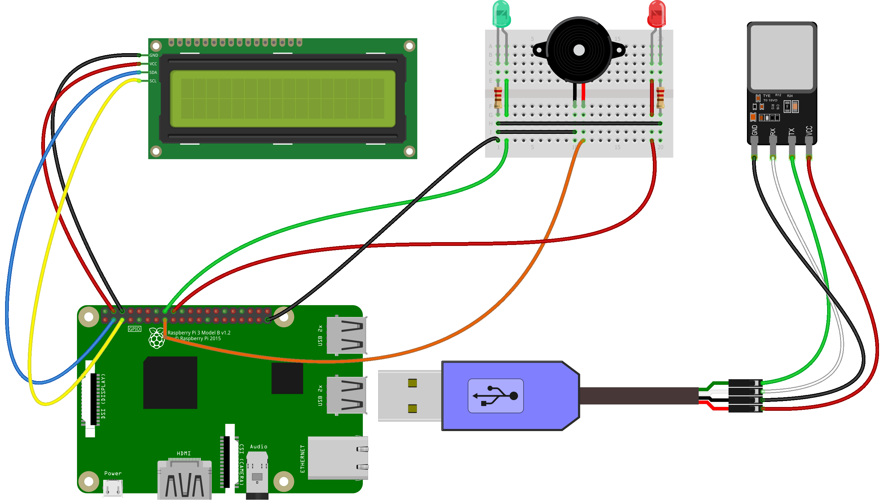

# Attfingerprint
This is an application/system that can be implemented by schools to make students mark their attendance using their fingerprints.

The architecture is divided into 3 main parts:
- **Server application:** Set up the database with different school tracks, weeks, subjects, and attendance lists.
- **Client application (Raspberry Pi 3):** Enroll students with fingerprints and store their information in the server's database.
- **Main application (Raspberry Pi 3:** The actual program that will be running to monitor attendance.

You can grab the application by typing:
```
$ git clone https://github.com/Zouhirs/attfingerprint
```

## Server Setup -`attinit`-
It is recommended to work in a python's virtual environment to avoid dependencies problems with other packages.
To create one, just use:
```Linux
$ python3 -m venv ~/env
```
Now that it is created, activate it with:
```Linux
$ source ~/env/bin/activate
```
Install necessary packages for the **attinit** application:
```Linux
$ cd attfingerprint/Server/attinit/
$ pip3 install -r requirements.txt
```
Next, install the application by running the following command if you want to modify the code:
```Linux
$ sudo chmod +x install.sh
$ ./install.sh
```
or if by this command if you want to use the raw version:
```Linux
$ pip3 install .
```
The server's application is ready to use now:
```Linux
$ attinit --help
```
You can deactivate the virtual environment by typing:
```Linux
$ deactivate
```

## Client Setup -`attconfig`-
Based on a Raspberry Pi 3 running Raspberry Pi OS (previously called Raspbian), and FPM10A fingerprint sensor (Diagram found below).
It is recommended to work in a python's virtual environment to avoid dependencies problems with other packages.
To create one, just use:
```Linux
$ python3 -m venv ~/env
```
Now that it is created, activate it with:
```Linux
$ source ~/env/bin/activate
```
Install necessary packages for the **attconfig** application:
```Linux
$ cd attfingerprint/Client/attconfig/
$ sudo apt-get install libjpeg-dev zlib1g-dev
$ pip3 install -r requirements.txt
```
Next, install the application by running the following command if you want to modify the code:
```Linux
$ sudo chmod +x install.sh
$ ./install.sh
```
or if by this command if you want to use the raw version:
```Linux
$ pip3 install .
```
The server's application is ready to use now:
```Linux
$ attconfig --help
```
You can deactivate the virtual environment by typing:
```Linux
$ deactivate
```

## Main Program Setup -`attmain`-
Based on a Raspberry Pi 3 running Raspberry Pi OS (previously called Raspbian), and FPM10A fingerprint sensor, LEDs, Buzzer, and an LCD with I2C bus. (Diagram found below).

Activate the virtual environment if not activated with:
```Linux
$ source ~/env/bin/activate
```
Install necessary packages for the **attmain** application if not installed:
```Linux
$ cd attfingerprint/Main/attmain/
$ sudo apt-get install libjpeg-dev zlib1g-dev
$ pip3 install -r requirements.txt
```
Next, install the application by running the following command if you want to modify the code:
```Linux
$ sudo chmod +x install.sh
$ ./install.sh
```
or if by this command if you want to use the raw version:
```Linux
$ pip3 install .
```
The server's application is ready to use now:
```Linux
$ attmain --help
```
You can deactivate the virtual environment by typing:
```Linux
$ deactivate
```
## Wiring:
Parts needed:
* Raspberry Pi 3.
* USB-TTL.
* FPM10A Fingerprint Sensor.
* LCD w/ I2C Interface.
* Red and Green LEDs w/ Resistors.
* Buzzer.

:warning: **Check if sensor works with 5v or 3.3v, USB-TTL should provide the same voltage.**


